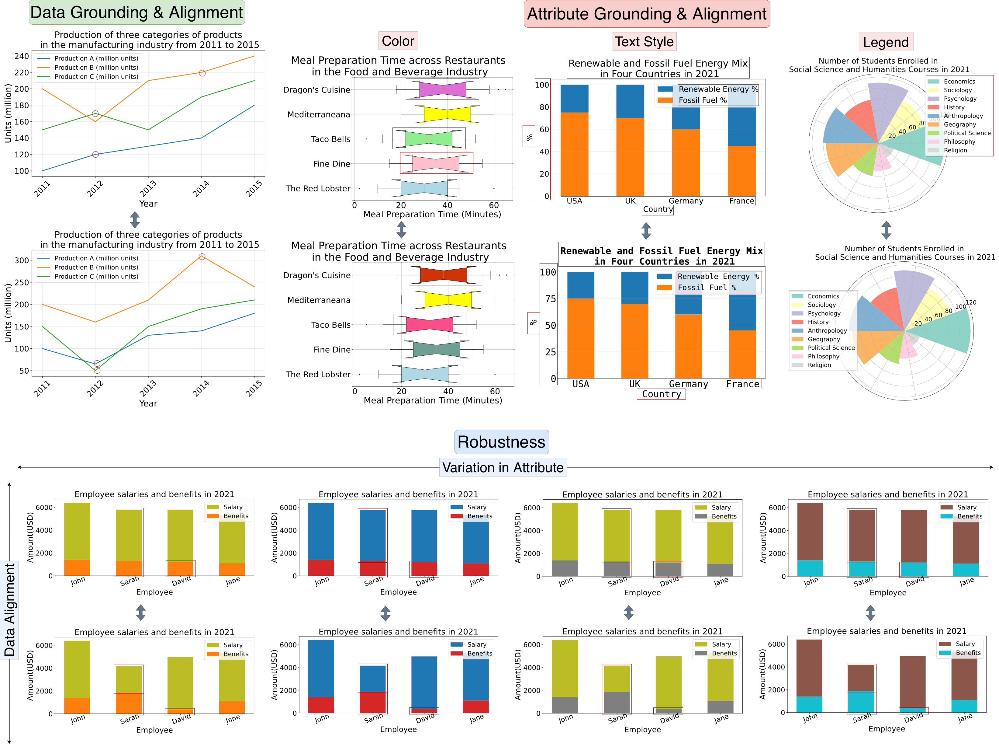

# 📊 ChartAlignBench

[**📖 Paper**]() | [**📚HuggingFace Dataset**](https://huggingface.co/datasets/umd-zhou-lab/ChartAlignBench)

This repo contains the official evaluation code and dataset for the paper "ChartAB: A Benchmark for Chart Grounding &amp; Dense Alignment"<br>

## Highlights
- 🔥 **9,000+** instances for VLM evaluation on **Dense Chart Grounding** and **Multi-Chart Alignment**.
- 🔥 Evaluation using novel **two stage pipeline** that decomposes task into **intermediate grounding followed by reasoning** resulting in significant accuracy improvement.
- 🔥 Evaluates both **data** and **attribute** understanding across **diverse chart types and complexities**.

## Findings
- 🔎 **Performance degradation on complex charts**: VLMs demonstrate strong data understanding on simple charts (e.g., bar, line, or numbered bar/line), but their performance drops substantially on complex types (e.g., 3D, box, radar, rose, or multi-axis charts) due to intricate layouts and component interactions.
- 🔎 **Weak attribute understanding**: VLMs exhibit poor recognition of text styles (<20% accuracy for size/font), limited color perception (median RGB error >50), and strong spatial biases in legend positioning.
- 🔎 **Two-stage pipeline proves superior**: The ground-then-reason approach consistently outperforms direct inference, reducing hallucinations through intermediate grounding steps.
- 🔎 **Poor grounding/alignment degrade downstream QA**: Precise data grounding and alignment correlate positively with downstream QA accuracy, establishing dense chart understanding as essential for reliable reasoning performance.
- 🔎 **Scaling law holds for most alignment tasks**: Larger models consistently outperform smaller ones on all but text-style alignment due to JSON generation complexity leading to high number of irregular failures.

## Dataset

ChartAB is the first benchmark designed to comprehensively evaluate the dense level understanding of VLMs on charts, focusing on two core content: data (the underlying values visualized by the chart) and attribute (visual attributes impacting chart design such as color, legend position, and text style). The benchmark consists of 9,000+ instances spanning 9 diverse chart types (bar, numbered bar, line, numbered line, 3D bar, box, radar, rose, and multi-axes charts) organized into three evaluation subsets. The **Data Grounding & Alignment** subset contains chart pairs that differ in data. The **Attribute Grounding & Alignment** subset comtains chart pairs differing in attributes. **Robustness** subset contains collection of 5 chart pairs per instance, where each pair maintains identical data difference but varies in an attribute value (color, legend, or text style) across the pairs. 

<p align="left">
  
  <br>
  <em>Examples of chart pairs in ChartAlignBench.</em>
</p>


## Evaluation Demo

### 1. Create and Activate a Conda Environment
```bash
conda create -n chart_ab python=3.10
conda activate chart_ab
pip install -r requirements.txt  
